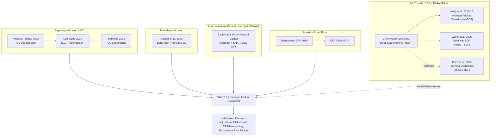

# ML & AI für Cost of Capital / WACC — Fokus-Map

**Zweck dieser Gruppe:** Bündelt gezielt die Schnittmenge **Asset Pricing ∩ Machine Learning/AI ∩ Kapitalkosten (WACC / Cost of Equity / Cost of Debt / Diskontsatz)**. Der „Nenner" der Bewertung — wo ML/AI den Diskontsatz schätzt, statt nur Cashflows zu prognostizieren. Querschnitt über die Streams [[Cost of Capital]], [[Discount Rate Estimation]] und [[Asset Pricing]].

## Lesart
- **Eigenkapitalseite (ICC):** Kernspannung [[Earnings Forecast Accuracy and Implied Cost of Capital]] (bessere Prognose → besserer Diskontsatz) vs. [[The Implied Cost of Capital – A Machine Learning Approach]] (Gegenbefund); international geprüft in [[ML Earnings Forecasting und ICC International]].
- **Interpretierbarkeit (WU-Heimvorteil):** [[Explainable Machine Learning to Predict the Cost of Capital]] öffnet die Black Box (XGBoost + SHAP) und zeigt, dass sogar ESG/Governance eigenständig auf die Kapitalkosten wirken — ideal für den Auditing-/Regulierungskontext.
- **Fremdkapitalseite:** [[Bond Risk Premiums with Machine Learning]] deckt die Debt-Seite des WACC.
- **Marktimplizite Zielgrößen:** [[What the Market Knows That WACC Doesn't (MIDR)]] und [[Equity Risk Premiums 2026 und Cost of Capital by Industry]] liefern beobachtbare Sätze zum Kalibrieren/Testen.
- **AP-Theorie (der Diskontfaktor selbst):** [[Deep Learning in Asset Pricing]] → [[Artificial Intelligence Asset Pricing Models]] / [[NewsNet-SDF]]; methodisch flankiert von [[Teaching Economics to the Machines]] (Theorie + ML).

## Offene Frage / Forschungsfenster
Der ungelöste Lee/Wang-vs-Barkfeldt-Widerspruch sitzt genau hier → [[Gaps – Valuation und Diskontsatz]].

## WU-Anknüpfung
Ideen: [[Distress-adjustierter Diskontsatz]] · [[ERP-Nowcasting mit ML]] · [[Textbasierte Latent Risk Factors für Kapitalkosten]] · [[LLM-basierte ICC-Schätzung]]

→ [[AI Valuation Research Program]]
